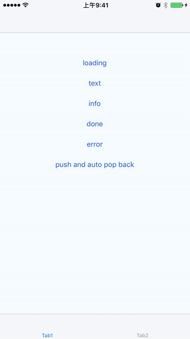

# react-native-toast-hybrid

A toast that can be used for react-native, while available for native android, ios.



## Installation

```
yarn add react-native-toast-hybrid
```

## Usage

[example](https://github.com/listenzz/react-native-toast-hybrid/blob/master/example/App.js)

```js
// Use in react code.

import { useToast } from 'react-native-toast-hybrid'

const toast = useToast()

text() {
    toast.text('Hello World!!')
}

info() {
    toast.info('A long long message to tell you.')
}

done() {
    toast.done('Work is done!')
}

error() {
    toast.error('Maybe somthing is wrong!')
}
```

As the word **Hybrid** implies, use in native is also supported.

```objc

// Use in iOS native code

- (IBAction)showText:(UIButton *)sender {
    [Toast text:@"Hello Native!"];
}

- (IBAction)showInfo:(UIButton *)sender {
    [Toast info:@"A long long message to tell you."];
}

- (IBAction)showDone:(UIButton *)sender {
    [Toast done:@"Work is done!"];
}

- (IBAction)showError:(UIButton *)sender {
    [Toast error:@"Maybe somthing is wrong!"];
}

```

```java
// Use in Android native code

root.findViewById(R.id.text).setOnClickListener(v -> {
    Toast.text(requireActivity(), "Hello Native!");
});

root.findViewById(R.id.info).setOnClickListener(v -> {
    Toast.info(requireActivity(), "A long long message to tell you.");
});

root.findViewById(R.id.done).setOnClickListener(v -> {
    Toast.done(requireActivity(), "Work is done!");
});

root.findViewById(R.id.error).setOnClickListener(v -> {
    Toast.error(requireActivity(), "Maybe somthing is wrong!");
});

```
